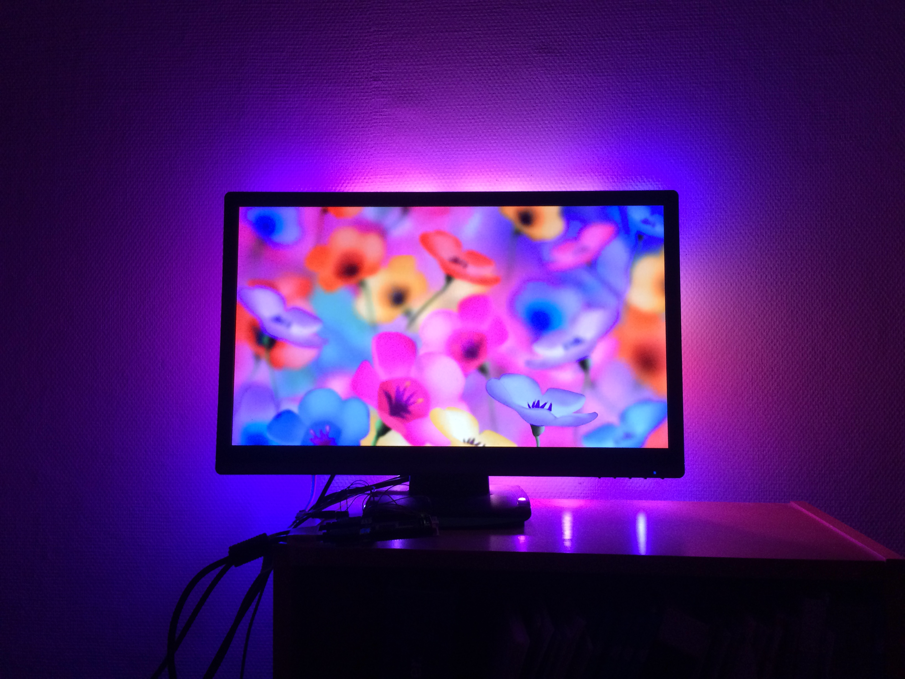
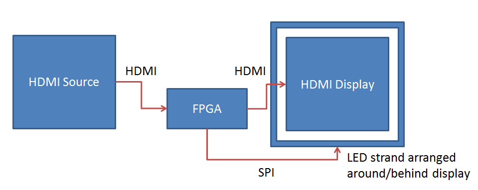

# Neppielight: DIY FPGA-based HDMI ambient lighting #

Ambient lighting is a technique that creates light effects around the television that correspond to the video content. It has been pioneered by Philips under the brand Ambilight. In this project we will create a basic FPGA-based ambient lighting system that reads the video signal over HDMI. This means we can use it together with DVD players, video game consoles, etc.

## Design outline

Ideally we would like to snag the signal off the HDMI cable without disturbing it. However, the signals are really really fast current mode logic differential pairs, and signal integrity issues make any kind of passive tap a non-starter. We are stuck with doing the next best thing: decoding and recoding the signal. This has the advantage that we gain the ability to modify the signal on the way through the system to add debug information etc.

Thanks to our "man in the middle" position between the player and the display we can see all the pixel values, aggregate them in properly sized and positioned boxes and use this signal to drive a strand of LEDs over their SPI interface. These LEDs will be arranged in a ring around the back of the display, resulting in an ambient lighting effect.

## More Information

For more information, including demo videos, refer to the the [blog post](http://zerocharactersleft.blogspot.nl/2015/04/diy-fpga-based-hdmi-ambient-lighting.html "blog post") about this project.
